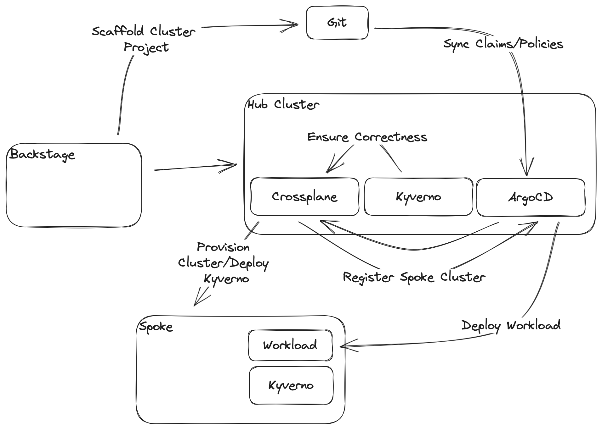

# back-stack

Introducing the BACK Stack




## Prerequisites
For a local install, you need kind installed and a bash-compatible shell.

## Getting started
- Fork and clone this repo
  ```sh
  gh repo fork opendev-ie/back-stack --clone
  ```
- Create a personal access token [link](https://docs.github.com/en/authentication/keeping-your-account-and-data-secure/xmanaging-your-personal-access-tokens#creating-a-personal-access-token-classic)
- Configure `./.env` with your personal access token, the repository url, and the vault token
  
  ```properties
  GITHUB_TOKEN=<personal access token>
  REPOSITORY=https://github.com/<path to forked repo>
  VAULT_TOKEN=root # this is the default for 'dev' mode
  ```
- Run the installer
  ```sh
  ./local-install.sh
  ```